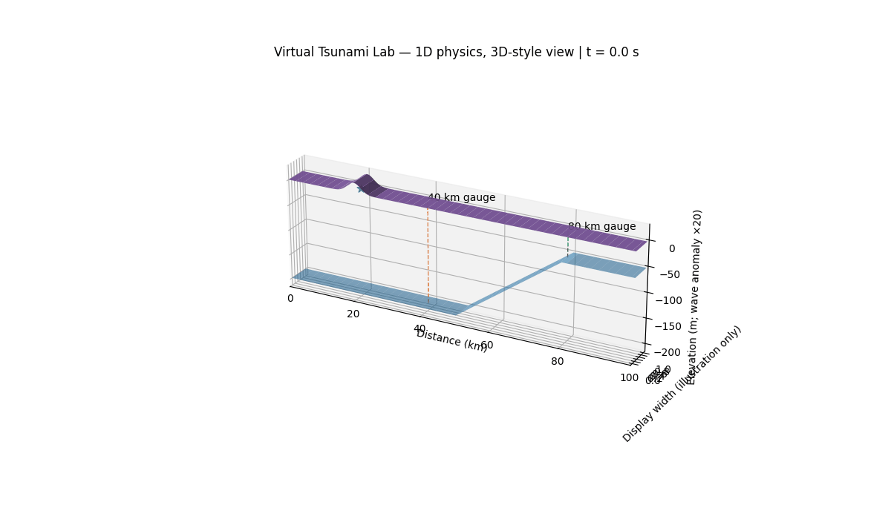
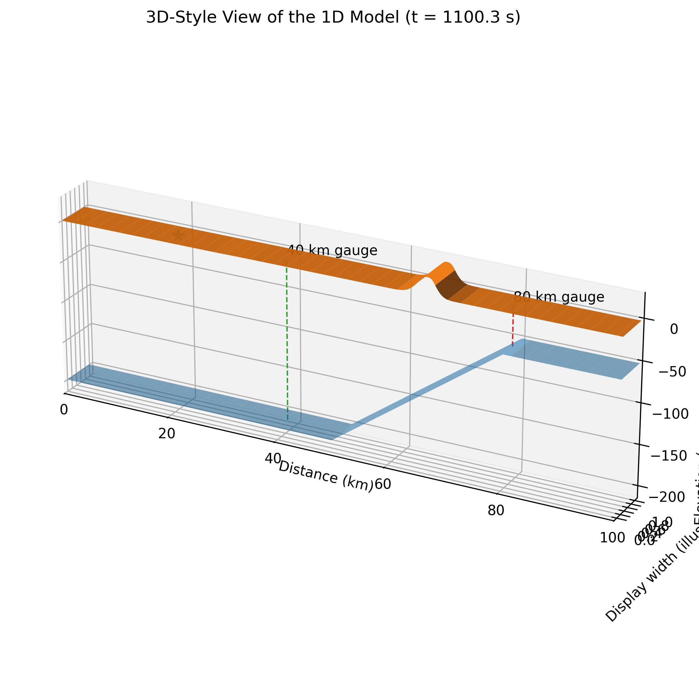
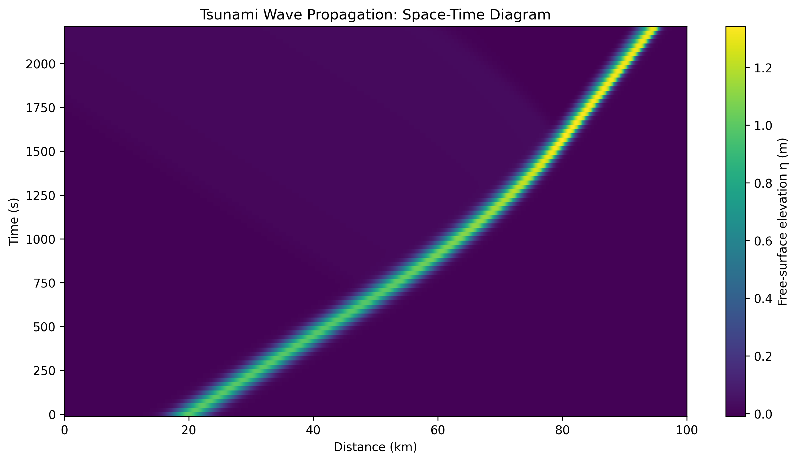
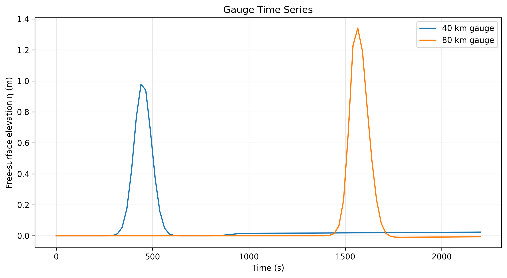
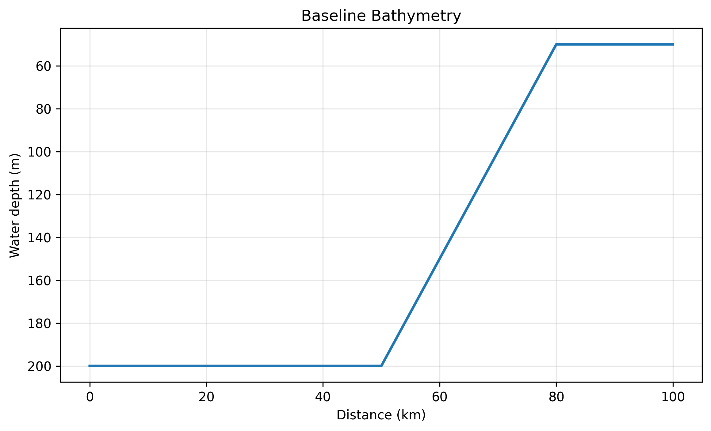
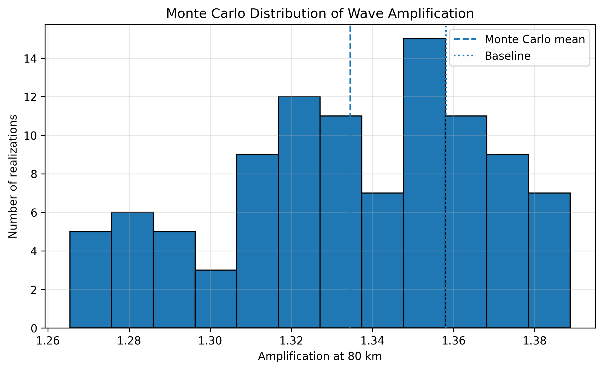
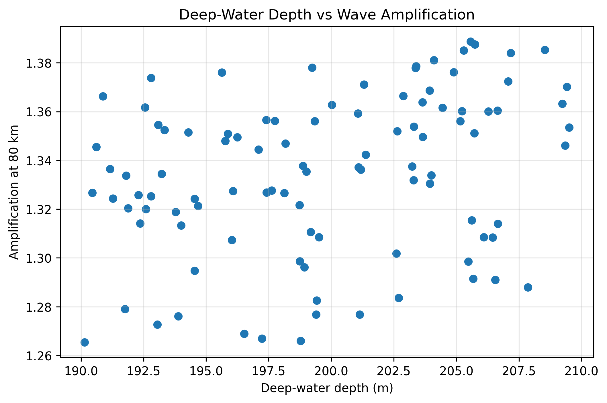
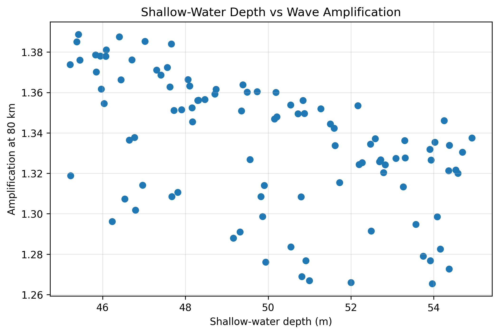
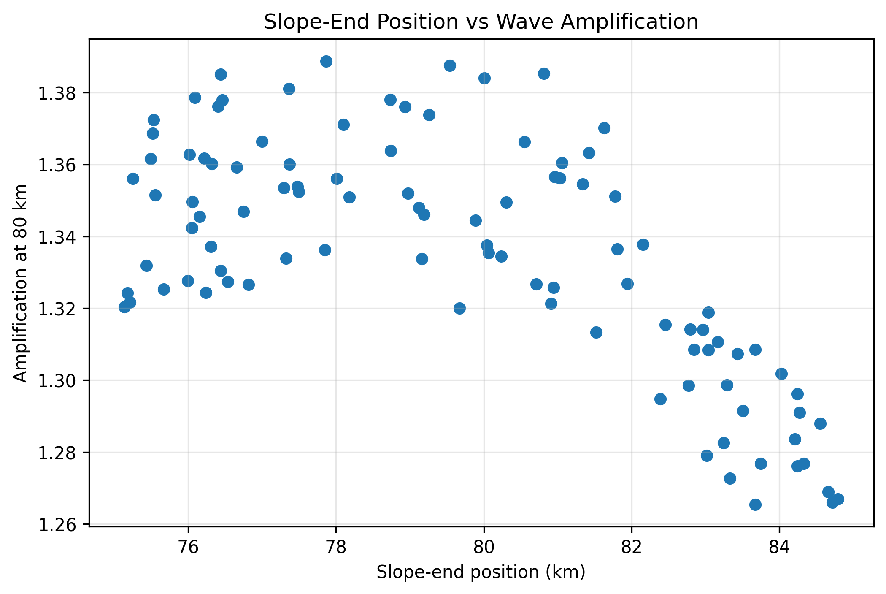
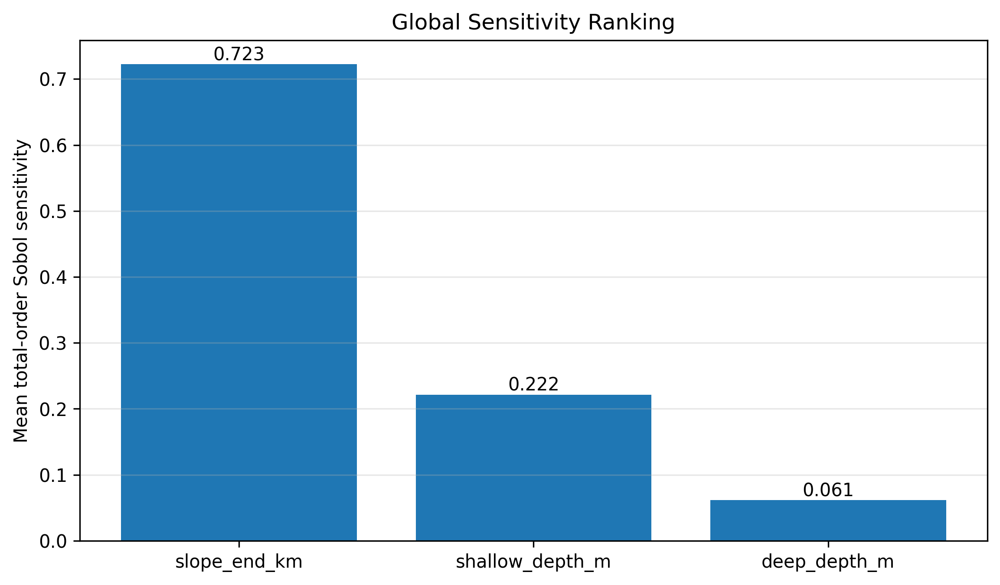

# 1D Tsunami Wave Simulator with Bathymetric Uncertainty

A research-oriented 1D nonlinear shallow-water model for studying tsunami-wave propagation, shoaling, uncertainty propagation, and sensitivity to uncertain bathymetric parameters.


## Visual gallery

The figures below show the simulated wave, the idealized bathymetry, and the uncertainty/sensitivity results. The animated 3D-style ribbon is a visualization of a **1D** simulation: its display-width axis is illustrative, and the wave elevation is visually exaggerated. It is **not** a 3D fluid solver.

### Wave propagation

<p align="center">
  <a href="tsunami-simulator/uq_outputs/virtual_lab/virtual_tsunami_3d.gif">
    
  </a>
</p>
<p align="center"><em>Wave evolution over the idealized seafloor. Click the animation to open the original GIF.</em></p>

<table>
  <tr>
    <td width="50%" align="center">
      <strong>3D-style snapshot</strong><br>
      <a href="tsunami-simulator/uq_outputs/virtual_lab/virtual_tsunami_3d_snapshot.png"></a>
    </td>
    <td width="50%" align="center">
      <strong>Space-time wave elevation</strong><br>
      <a href="tsunami-simulator/uq_outputs/virtual_lab/space_time_wave.png"></a>
    </td>
  </tr>
  <tr>
    <td width="50%" align="center">
      <strong>Gauge time series</strong><br>
      <a href="tsunami-simulator/uq_outputs/virtual_lab/gauge_timeseries.png"></a>
    </td>
    <td width="50%" align="center">
      <strong>Bathymetry profile</strong><br>
      <a href="tsunami-simulator/uq_outputs/final_figures/01_bathymetry_profile.png"></a>
    </td>
  </tr>
</table>

### Uncertainty and sensitivity results

<table>
  <tr>
    <td width="50%" align="center">
      <strong>Amplification distribution</strong><br>
      <a href="tsunami-simulator/uq_outputs/final_figures/02_amplification_distribution.png"></a>
    </td>
    <td width="50%" align="center">
      <strong>Deep-water depth</strong><br>
      <a href="tsunami-simulator/uq_outputs/final_figures/03_deep_depth_vs_amplification.png"></a>
    </td>
  </tr>
  <tr>
    <td width="50%" align="center">
      <strong>Shallow-water depth</strong><br>
      <a href="tsunami-simulator/uq_outputs/final_figures/04_shallow_depth_vs_amplification.png"></a>
    </td>
    <td width="50%" align="center">
      <strong>Slope-end position</strong><br>
      <a href="tsunami-simulator/uq_outputs/final_figures/05_slope_end_vs_amplification.png"></a>
    </td>
  </tr>
  <tr>
    <td colspan="2" align="center">
      <strong>Global sensitivity ranking</strong><br>
      <a href="tsunami-simulator/uq_outputs/final_figures/06_sensitivity_ranking.png"></a>
    </td>
  </tr>
</table>


## Project objective

The project investigates how uncertainty in idealized bathymetry affects modeled wave amplification at a fixed downstream gauge.

The current study varies three synthetic bathymetric parameters:

| Parameter | Range |
|---|---:|
| Deep-water depth | 190–210 m |
| Shallow-water depth | 45–55 m |
| Slope-end position | 75–85 km |

These ranges are development assumptions, not observational uncertainty bounds.

## Numerical model

The solver is based on the nonlinear shallow-water equations in conservative form:

\[
H_t + (Hu)_x = 0
\]

\[
(Hu)_t + \left(Hu^2 + \frac{1}{2}gH^2\right)_x = -gHb_x
\]

where:

- \(H=h+\eta\) is total water depth,
- \(u\) is depth-averaged velocity,
- \(h\) is still-water depth,
- \(\eta\) is free-surface elevation,
- \(b(x)\) is bed elevation,
- \(g\) is gravitational acceleration.

The current numerical implementation uses:

- finite-volume discretization,
- MUSCL reconstruction,
- minmod slope limiting,
- Rusanov numerical flux,
- hydrostatic reconstruction,
- SSP-RK2 time integration,
- CFL-based adaptive time stepping.

## Validation and deterministic experiments

The project includes constant-depth wave-speed checks, grid-sensitivity tests, still-water well-balancing checks, variable-bathymetry shoaling experiments, and nonlinear-amplitude experiments.

For the validated baseline case:

- deep depth = 200 m,
- shallow depth = 50 m,
- slope end = 80 km,
- 40 km amplitude ≈ 0.98726 m,
- 80 km amplitude ≈ 1.34080 m,
- amplification ≈ **1.35811×**.

## Uncertainty quantification

### Single-parameter Monte Carlo

A 100-sample experiment with shallow depth uniformly distributed between 45 and 55 m produced:

- mean amplification ≈ 1.35937×,
- standard deviation ≈ 0.01620×.

### Multivariate Monte Carlo

With all three bathymetric parameters uncertain over the ranges above, 100 realizations produced:

- mean amplification = **1.33455×**,
- standard deviation = **0.03266×**,
- minimum sampled amplification = 1.26544×,
- maximum sampled amplification = 1.38875×,
- 5th percentile = 1.27592×,
- median = 1.33681×,
- 95th percentile = 1.38127×.

The Monte Carlo ensemble shows that bathymetric uncertainty propagates into a measurable spread in the modeled amplification.

## Sensitivity analysis

### Exploratory analysis

Pearson correlations:

| Parameter | Correlation |
|---|---:|
| Deep depth | +0.29182 |
| Shallow depth | −0.53299 |
| Slope end | −0.66997 |

Spearman correlations:

| Parameter | Correlation |
|---|---:|
| Deep depth | +0.31034 |
| Shallow depth | −0.57026 |
| Slope end | −0.61089 |

A standardized linear regression gave:

| Parameter | Standardized coefficient |
|---|---:|
| Deep depth | +0.19399 |
| Shallow depth | −0.49486 |
| Slope end | −0.65218 |

Linear-model \(R^2\) = **0.75730**.

### Morris screening

A 64-trajectory Morris experiment used 256 model evaluations.

| Parameter | \(\mu^*\) | \(\sigma\) |
|---|---:|---:|
| Slope end | **0.08702** | **0.06254** |
| Shallow depth | 0.05060 | 0.00897 |
| Deep depth | 0.02561 | 0.00479 |

The ranking is:

**slope end > shallow depth > deep depth**

The comparatively large \(\sigma\) for slope end suggests stronger nonlinear and/or interaction effects within the tested parameter range.

### Replicated Sobol analysis

The replicated Sobol experiment produced mean total-order sensitivities:

| Parameter | Mean \(S_T\) |
|---|---:|
| Slope end | **0.72263** |
| Shallow depth | **0.22153** |
| Deep depth | **0.06146** |

The first-order Sobol estimates were still noisy, so their exact numerical values are not treated as converged final estimates. The total-order ranking was substantially more stable and is used for the main interpretation.

## Main finding

Across Monte Carlo analysis, correlation/regression analysis, Morris screening, and replicated Sobol total-order analysis, the same hierarchy was observed:

\[
\boxed{\text{slope-end position} > \text{shallow-water depth} > \text{deep-water depth}}
\]

For the synthetic uncertainty ranges used here, slope-end position is the dominant uncertain bathymetric feature controlling modeled wave amplification at the 80 km gauge.

## Outputs

When the scripts are run from the `tsunami-simulator/` source directory, the uncertainty and sensitivity experiments write data and figures under `tsunami-simulator/uq_outputs/` in the repository.

Important outputs include:

```text
tsunami-simulator/uq_outputs/
├── uq_results_multivariate.csv
├── scatter_deep_depth.png
├── scatter_shallow_depth.png
├── scatter_slope_end.png
├── morris_model_runs.csv
├── morris_sensitivity_summary.csv
├── morris_sensitivity.png
├── sobol_robust_replicates.csv
├── sobol_robust_summary.csv
├── sobol_robust_sensitivity.png
└── final_figures/
```

## Running the project

Python interpreter used during development:

```text
C:\Python313\python.exe
```

Install dependencies from the repository root:

```powershell
python -m pip install -r requirements.txt
```

Launch the interactive dashboard:

```powershell
cd tsunami-simulator
python -m streamlit run tsunami_dashboard.py
```

Then open `http://localhost:8501` in your browser. Keep `tsunami_dashboard.py` and `tsunami_virtual_lab.py` in the same source directory.

Run the numerical experiment scripts from `tsunami-simulator/` as needed:

```powershell
python tsunami_muscl_bathymetry.py
python tsunami_uncertainty.py
python tsunami_uncertainty_multi.py
python analyze_uq.py
python morris_sensitivity.py --trajectories 64
python sobol_sensitivity_robust.py --base-samples 64 --replicates 4
python make_final_figures.py
```

## Scientific limitations

This is a research prototype rather than a validated operational tsunami forecasting system.

Important limitations include:

1. The uncertainty ranges are synthetic.
2. The current model is one-dimensional.
3. Directional spreading, complex coastal geometry, and fully 2D effects are not represented.
4. The amplification metric is tied to fixed model gauges.
5. Green's-law comparisons are theoretical reference checks rather than exact validation of the nonlinear solver.
6. Additional established benchmark cases are required before publication-level validation claims.
7. Sensitivity results depend on the chosen uncertainty parameterization, parameter ranges, source conditions, numerical resolution, and output metric.

## Suggested project description

> Developed a 1D nonlinear shallow-water tsunami simulator with MUSCL finite-volume discretization, hydrostatic reconstruction, and uncertainty propagation over variable bathymetry. Performed Monte Carlo UQ and global sensitivity analysis using Morris screening and replicated Sobol total-order estimates, identifying bathymetric slope-end position as the dominant uncertainty source for modeled wave amplification.

## Next research extensions

- Validate additional analytical and benchmark cases.
- Replace synthetic bathymetric ranges with physically motivated uncertainty.
- Test multiple source amplitudes and source locations.
- Evaluate alternative bathymetry parameterizations.
- Extend the methodology toward 2D modeling.
- Investigate uncertainty-aware surrogate models for rapid prediction.
